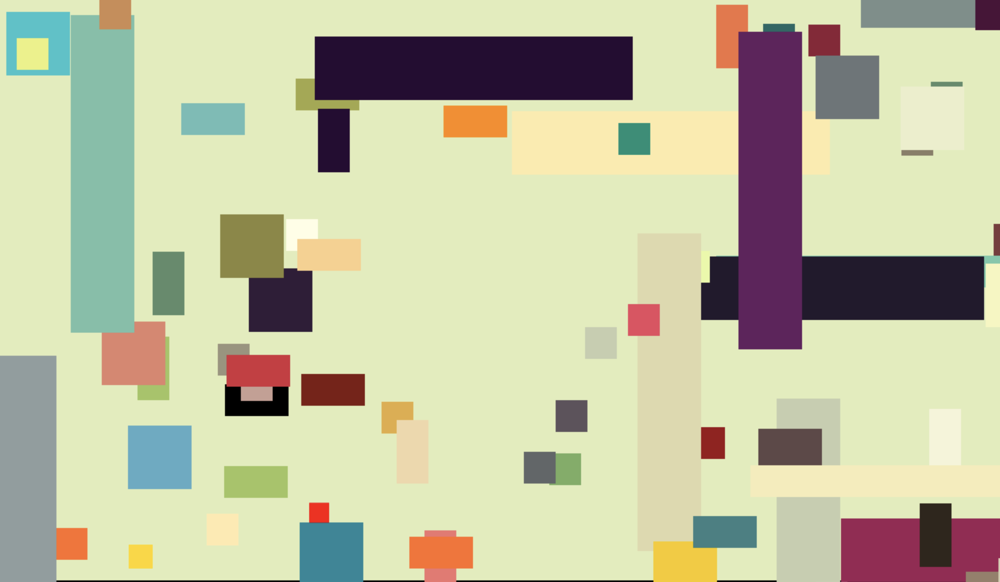
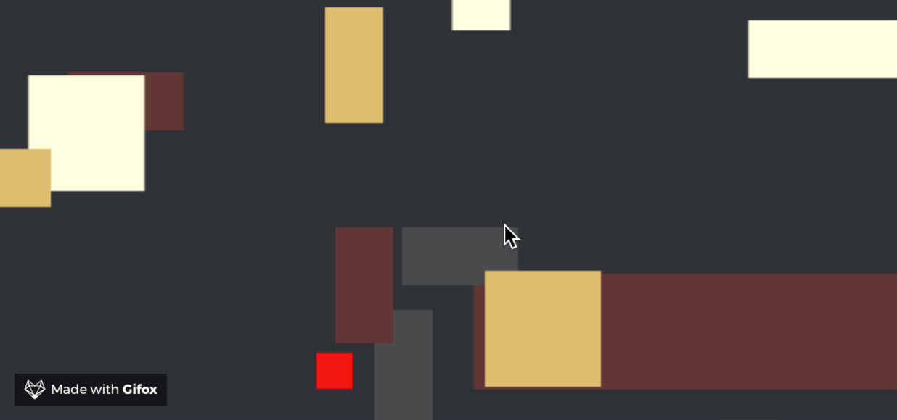

Boxfarter
=========
Boxfarter is a javascript platformer game, shoddily programmed by Wyatt Carss.
To play, visit [wcarss.ca/boxfarter](http://wcarss.ca/boxfarter).

Instructions
============
You're the little red box. Get to the little gold box.
Arrows move/jump, space farts a box. If you're jumping while you fart you will *keep jumping*.
When you get to the gold box, your reward is another level.
If you can't see the gold or the red box, I'm a bad programmer and you should refresh the page.

Credits
=======
* palettes - Matt DesLaurier compiled this list and has it under the rest of the CC-BY-NC-SA-4.0-licensed project at https://github.com/mattdesl/audiograph.xyz/blob/master/lib/color-palettes.json, originally sourced from http://www.colourlovers.com/
* skeleton of js rendering and collision code - @loktar00 provided it in "Creating a canvas platformer tutorial" parts 1 and 2, at http://www.somethinghitme.com/2013/01/09/creating-a-canvas-platformer-tutorial-part-one/, which is used here under the assumption that publicly available educational material is free to adapt and reuse.
* other code and art (haha -_-') - Wyatt Carss

License
=======
Except where otherwise licensed (i.e. source material listed above), this work is licensed under the Creative Commons Attribution-NonCommercial-ShareAlike 4.0 International License. To view a copy of this license, visit http://creativecommons.org/licenses/by-nc-sa/4.0/ or send a letter to Creative Commons, PO Box 1866, Mountain View, CA 94042, USA.
